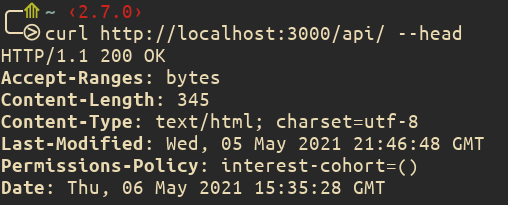

# GIN-NO-FLOC

This is a middleware to disable floc on gin gonic servers. It just sets a single header super simply

## Usage

``` go
package main

import (
    "github.com/gin-gonic/gin"
    "github.com/mandrigin/gin-spa/spa"
    "github.com/prairir/gin-no-floc/noFloc"
)

func main() {
    r := gin.Default()
    r.Use(noFloc.Middleware())
    r.Run()
}
```

## Photo of headers



## Contributing
You can read all about contributing to this project in `CONTRIBUTING.md`
